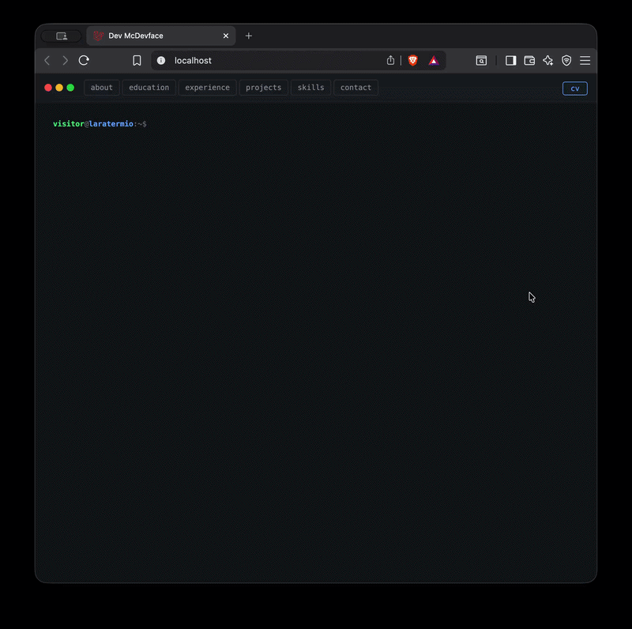

```
██╗      █████╗ ██████╗  █████╗ ████████╗███████╗██████╗ ███╗   ███╗██╗ ██████╗
██║     ██╔══██╗██╔══██╗██╔══██╗╚══██╔══╝██╔════╝██╔══██╗████╗ ████║██║██╔═══██╗
██║     ███████║██████╔╝███████║   ██║   █████╗  ██████╔╝██╔████╔██║██║██║   ██║
██║     ██╔══██║██╔══██╗██╔══██║   ██║   ██╔══╝  ██╔══██╗██║╚██╔╝██║██║██║   ██║
███████╗██║  ██║██║  ██║██║  ██║   ██║   ███████╗██║  ██║██║ ╚═╝ ██║██║╚██████╔╝
╚══════╝╚═╝  ╚═╝╚═╝  ╚═╝╚═╝  ╚═╝   ╚═╝   ╚══════╝╚═╝  ╚═╝╚═╝     ╚═╝╚═╝ ╚═════╝
```




**Your portfolio lives in the terminal.** Visitors type commands to explore your work — no scrolling, no nav menus, no template layout. Content is managed through a Filament admin panel, and the whole thing generates a print-ready PDF CV on demand.

> **Live app:** <a href="https://apaliampelos.me" target="_blank">apaliampelos.me</a>  
> **Docs:** <a href="https://apaliampelos.me/docs" target="_blank">apaliampelos.me/docs</a>

---

## How it works

The entire portfolio runs inside a browser-based terminal emulator. A visitor arrives, sees a prompt, and types commands to explore.

```
visitor@laratermio:~$ help

  explore
    about                       — Who I am and what drives me
    contact                     — Get in touch
    contact <email> <message>   — Drop your email and a short message
    education                   — Education & certifications
    open <name>                 — Open a link in a new tab
    search <query>              — Search across education, experience, projects, skills
    skills                      — Technical skills and stack

  experience
    experience                  — Work history
    experience <n>              — Jump directly to experience n
    experience -a               — Full work history at once

  projects
    projects                    — Side projects and open source
    projects <n>                — Jump directly to project n
    projects -a                 — All projects at once
    
  system
    cd <dir>                    — Navigate the portfolio filesystem
    clear                       — Clear the terminal screen
    history                     — Show command history
    ls                          — List files in the current directory
    theme <mode>                — Switch color scheme (light / dark / system)
    whoami                      — Print current user identity
```

> Curious? There are more commands that won't appear in `help` — explore and find them.

### Admin panel

Everything editable at `/admin` via Filament — no code changes needed:

| Area | What you can manage |
|---|---|
| Content | Experience, education, projects, skills, contact info |
| Terminal | Enable/disable commands, edit labels and descriptions |
| Navigation | Which commands appear in the nav bar and in what order |
| Settings | Name, role, prompt, ASCII art, SEO meta, favicon |
| Messages | Contact form submissions |
| Import Demo Content | Re-seed selected sections with placeholder content |

### PDF CV generator

Hit **Generate** in the admin panel and DomPDF renders your terminal content — experience, education, skills, projects, contact — to a clean A4 PDF. The `cv` link appears automatically in the terminal nav once the file exists. One source of truth for your portfolio and your resume.

---

## Local development (Sail / Docker)

```bash
cp .env.example .env
composer install
./vendor/bin/sail up -d
./vendor/bin/sail artisan optimize
./vendor/bin/sail artisan key:generate
./vendor/bin/sail artisan optimize
./vendor/bin/sail artisan migrate --seed
./vendor/bin/sail npm install
./vendor/bin/sail npm run dev
```

Visit `http://localhost` — admin at `http://localhost/admin`.

---

Default admin password is `password`; you are forced to change it on first login.

### Seeding content

```bash
# Placeholder / demo content (fictitious data, safe to share)
./vendor/bin/sail artisan db:seed --class=ContentSeeder        # or: sail artisan ...

# Your real content (edit the seeder with your own data first)
./vendor/bin/sail  artisan db:seed --class=PersonalContentSeeder
```

Both seeders truncate their tables before inserting. Settings files are wiped from disk and re-uploaded from `public/stubs/`; project media is deleted (including files) and re-attached.

You can also re-seed individual sections from the admin panel at **Content → Import Demo Content**, which lets you pick which sections to replace without touching the rest.

### Environment variables

```dotenv
APP_URL=http://localhost

DB_CONNECTION=mysql
DB_HOST=mysql
DB_PORT=3306
DB_DATABASE=laratermio
DB_USERNAME=root
DB_PASSWORD=

# Resend — outgoing mail for the contact form
RESEND_API_KEY=re_...
MAIL_FROM_ADDRESS=you@yourdomain.com

# Admin account, created on first seed.
# Contact form messages from the terminal are delivered to this address.
ADMIN_EMAIL=foobar@yourdomain.com
ADMIN_NAME="Foo Bar"
```

### Running checks

```bash
# All checks — lint, static analysis, tests
./vendor/bin/sail composer test
# Static analysis (PHPStan / Larastan)
./vendor/bin/sail composer types:check
# or directly:
./vendor/bin/sail bin phpstan analyse --memory-limit 1G
```